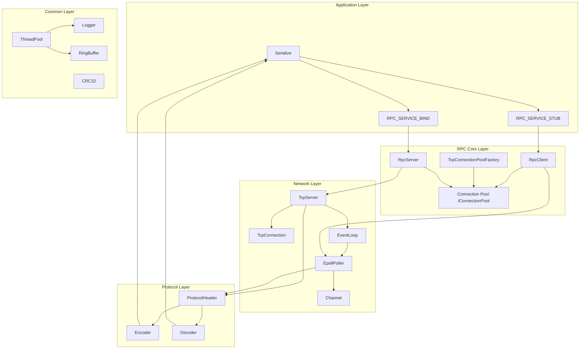
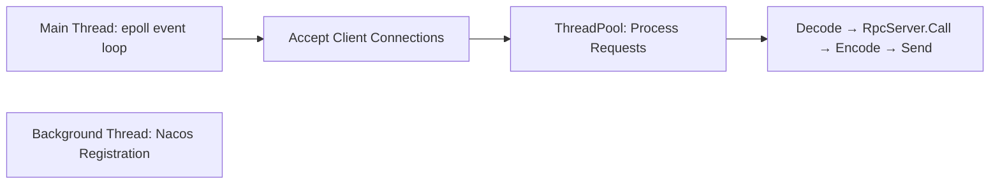
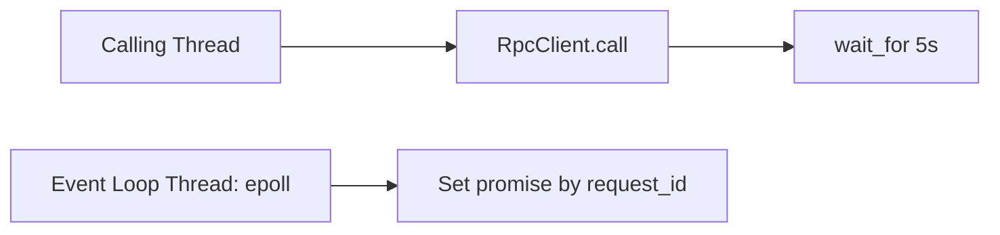

# Architecture Overview

mini-rpc adopts a layered architecture design with four core layers, each with clear responsibilities and well-defined boundaries.

## Architecture Diagram

## Layer Description

### 1. Protocol Layer (Protocol)

Defines the **data format** for RPC communication — the foundation of the entire framework.

- **ProtocolHeader**: 27-byte fixed header containing magic number `0x5250`, version, message type, serialization format, request ID, body length, CRC32 checksum, etc.
- **Encoder**: Assembles service name + serialized data into a complete packet
- **Decoder**: Parses binary data, validates magic number and CRC32, extracts message header and body
- **Serialize**: Serialization interface supporting JSON (nlohmann/json), with Protobuf interface reserved

### 2. Network Layer (Network)

Responsible for **TCP connection lifecycle management** and **I/O event handling**.

- **TcpServer**: Server-side TCP server based on epoll ET mode, managing listening socket and client connections
- **EventLoop**: Event loop wrapping Poller's select/update/remove operations
- **EpollPoller**: Default epoll multiplexer supporting both ET and LT trigger modes
- **Channel**: Maps file descriptors to event callbacks
- **TcpConnection**: Wraps TCP connection read/write buffering, message reading and protocol decoding

### 3. RPC Core Layer (Core)

Implements **RPC semantics**: service registration, method binding, request routing, connection pool management.

- **RpcServer**: Service registration and management, maintaining `method name → handler function` mapping
- **RpcClient**: Singleton RPC client, correlating requests and responses via request_id
- **IConnectionPool**: Connection pool interface supporting connection borrow and return
- **RpcConnectionPool**: Concrete connection pool implementation, one pool per service with independent event loop thread
- **IConnectionPoolFactory**: Connection pool factory, caching pools keyed by `serviceName@groupName`
- **RpcConnection**: Implements IConnection interface, managing individual TCP connection lifecycle

### 4. Common Layer (Common)

Provides **infrastructure components** shared across the framework.

- **ThreadPool**: Thread pool based on `std::packaged_task` + `std::future` for async tasks
- **Logger**: Logging system with sync/async write support and multi-level filtering
- **RingBuffer**: Circular buffer supporting scatter-gather I/O (readv/writev)
- **CRC32**: Cyclic redundancy check for packet integrity verification

## Threading Model

### Server Side

- **Main Thread**: Runs epoll event loop, handles connection acceptance
- **ThreadPool**: Processes established connections — decode, RPC invoke, encode response, send
- **Background Thread**: Registers services with Nacos

### Client Side

- **Calling Thread**: Calls stub method, serializes params, sends request, blocks waiting for response (5s timeout)
- **Event Loop Thread**: Each connection pool has its own event loop, matches responses to promises via request_id

## Data Flow

Complete RPC call flow:

1. **Client**: `stub.method(args)` → `RpcClient::call()` serializes parameters
2. **Encode**: `Encoder::Encode()` builds complete packet (Header + ServiceName + Body + CRC32)
3. **Send**: Gets connection from pool, sends packet to server
4. **Server**: `TcpServer::ClienHandler` reads data → decode → `RpcServer::Call()` finds and invokes handler
5. **Response**: `Encoder::Encode()` encodes response → sends back to client
6. **Client**: Receives response → `messageHandler()` finds promise via request_id → `set_value()` → unblocks
7. **Result**: Deserializes response body, returns to caller
