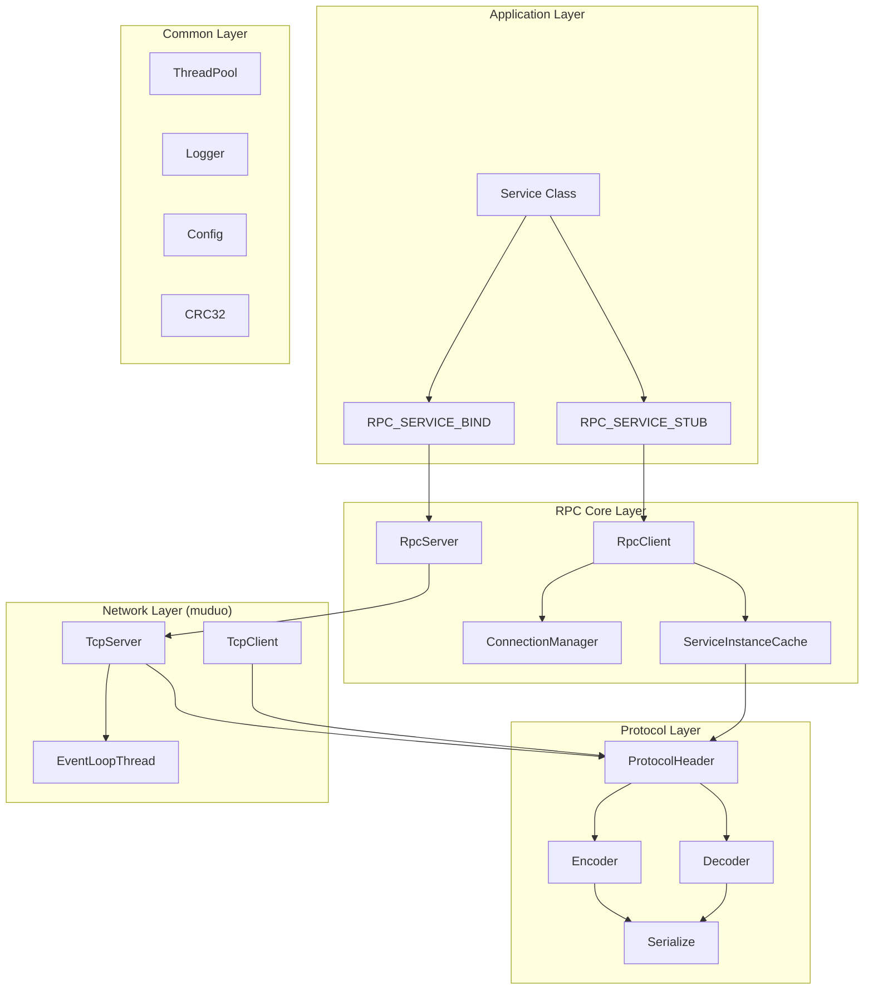
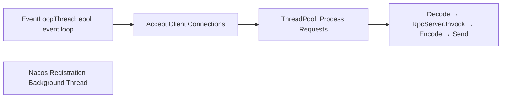
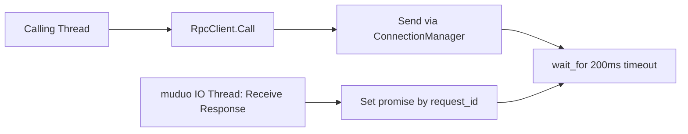

# Architecture Overview

mini-rpc adopts a layered architecture design with four core layers, each with clear responsibilities and well-defined boundaries. The network layer is based on the [muduo](https://github.com/chenshuo/muduo) network library.

## Architecture Diagram

```mermaid
graph TB
    subgraph Application["Application Layer"]
        S[Service Class]
        M1[RPC_SERVICE_BIND]
        M2[RPC_SERVICE_STUB]
        S --> M1
        S --> M2
    end

    subgraph Core["RPC Core Layer"]
        RS[RpcServer]
        RC[RpcClient]
        CM[ConnectionManager]
        SIC[ServiceInstanceCache]
        RC --> CM
        RC --> SIC
    end

    subgraph Net["Network Layer (muduo)"]
        TS[TcpServer]
        TC[TcpClient]
        EL[EventLoopThread]
        TS --> EL
    end

    subgraph Protocol["Protocol Layer"]
        P[ProtocolHeader]
        E[Encoder]
        D[Decoder]
        S2[Serialize]
        P --> E
        P --> D
        E --> S2
        D --> S2
    end

    subgraph Common["Common Layer"]
        TP[ThreadPool]
        LG[Logger]
        CF[Config]
        CR[CRC32]
    end

    M1 --> RS
    M2 --> RC
    RS --> TS
    TS --> P
    TC --> P
    SIC --> P
```

## Layer Description

### 1. Protocol Layer (Protocol)

Defines the **data format** for RPC communication — the foundation of the entire framework.

- **ProtocolHeader**: 27-byte fixed header containing magic number `0x5250`, version, message type, serialization format, request ID, body length, CRC32 checksum, etc.
- **Encoder**: Assembles service name + serialized data into a complete packet `[header | srv_name | body | check_num(4 bytes)]`
- **Decoder**: Parses binary data, validates magic number and CRC32, extracts message header and content
- **Serialize**: Automatic type detection:
  - `google::protobuf::Message` derived types → Protobuf serialization
  - Other types → JSON serialization (nlohmann/json)

### 2. Network Layer (Network)

**TCP connection management** based on the **muduo** network library.

- **TcpServer**: Server-side TCP server using muduo `EventLoopThread` for multi-threaded event loop
- **TcpClient**: Client-side TCP connection wrapper, manages muduo `TcpClient` lifecycle
- **ConnectionManager**: Connection manager, maintains connection pools to multiple server endpoints
- **EndPoint**: Network endpoint (host:port), used to identify server nodes

### 3. RPC Core Layer (Core)

Implements **RPC semantics**: service registration, method binding, request routing, connection management.

- **RpcServer**: Service registration and management, maintaining `method name → handler function` mapping
- **RpcClient**: Singleton RPC client, correlating requests and responses via `request_id`
- **ConnectionManager**: Manages connections to multiple server endpoints, randomly selects healthy connections
- **ServiceInstanceCache**: Nacos service instance subscription cache, based on `EventListener` pattern for real-time updates
- **PendingRequest**: Pending RPC request, associating connection and promise

### 4. Common Layer (Common)

Provides **infrastructure components** shared across the framework.

- **ThreadPool**: Thread pool based on `std::packaged_task` + `std::future` for async tasks
- **Logger**: Logging system with sync/async write support and multi-level filtering
- **Config**: TOML configuration file loader, supports service port, Nacos address, etc.
- **Random**: Thread-safe random number generator based on `mt19937`
- **CRC32**: Cyclic redundancy check for packet integrity verification
- **TimeStamp**: Microsecond-precision timestamp

## Threading Model

### Server Side

```mermaid
graph LR
    EL[EventLoopThread: epoll event loop] --> Accept[Accept Client Connections]
    Accept --> Pool[ThreadPool: Process Requests]
    Pool --> Handler[Decode → RpcServer.Invock → Encode → Send]
    Reg[Nacos Registration Background Thread]
```

- **EventLoopThread**: muduo event loop thread, handles all I/O events
- **ThreadPool**: Server-side request processing thread pool
- **Nacos Registration Thread**: Background thread for Nacos service registration

### Client Side

```mermaid
graph LR
    Caller[Calling Thread] --> Call[RpcClient.Call]
    Call --> Send[Send via ConnectionManager]
    Send --> Wait[wait_for 200ms timeout]
    Handler[muduo IO Thread: Receive Response]
    Handler --> Match[Set promise by request_id]
    Match --> Wait
```

- **Calling Thread**: Calls stub method, serializes params, sends request, blocks waiting for response (200ms timeout)
- **muduo IO Thread**: TcpClient's internal event loop, matches responses to promises via request_id
- **ServiceInstanceCache**: Based on Nacos subscription pattern, updates instance list in the background (non-blocking)

## Data Flow

Complete RPC call flow:

1. **Client**: `stub.method(args)` → `RpcClient::Call()` serializes parameters
2. **Encode**: `Encoder::EncodeReq()` builds complete packet (Header + ServiceName + Body + CRC32 CheckNum)
3. **Service Discovery**: `ServiceInstanceCache` reads instance list from subscription cache (no network IO)
4. **Send**: `ConnectionManager` randomly selects a healthy connection and sends the packet
5. **Server**: muduo event loop receives data → `RpcServer::MessageHandler` decodes → `RpcServer::Invock()` finds and invokes handler
6. **Response**: `Encoder::SuccessRes()` encodes response → sends back to client
7. **Client**: muduo IO thread receives response → `RpcClient::MessageHandler` finds promise via request_id → `set_value()` → unblocks
8. **Result**: Deserializes response body, returns to caller
