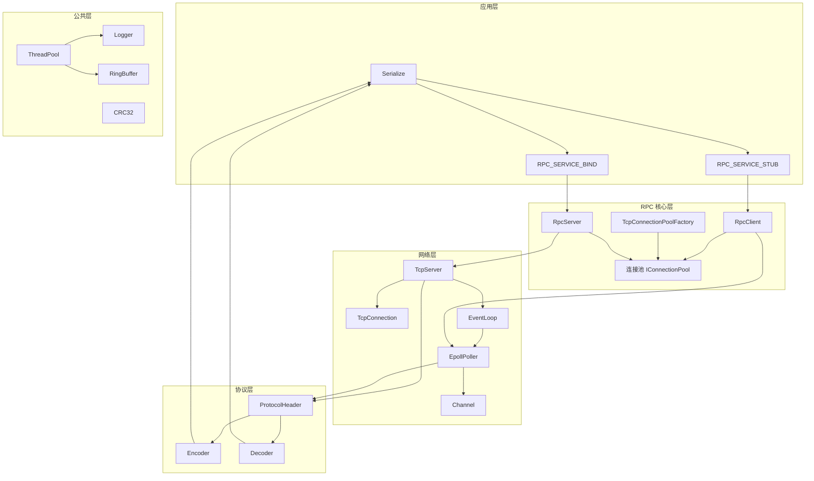
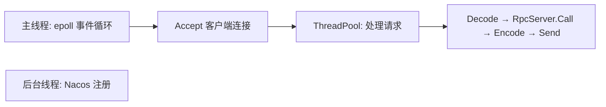
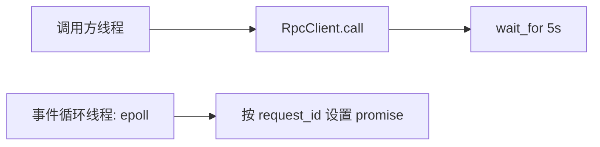

# 架构概览

mini-rpc 采用分层架构设计，自底向上分为四个核心层次，每层职责清晰、边界明确。

## 架构图

## 层次说明

### 1. 协议层 (Protocol)

定义 RPC 通信的**数据格式**，是整个框架的基石。

- **ProtocolHeader**: 27 字节固定头部，包含魔术字 `0x5250`、版本号、消息类型、序列化方式、请求 ID、报文体长度、CRC32 校验码等
- **Encoder**: 将服务名 + 序列化数据组装为完整数据包
- **Decoder**: 解析二进制数据，验证魔术字和 CRC32，提取消息头与内容
- **Serialize**: 序列化接口，当前支持 JSON (nlohmann/json)，Protobuf 预留接口

### 2. 网络层 (Network)

负责 **TCP 连接的生命周期管理** 和 **I/O 事件处理**。

- **TcpServer**: 服务端 TCP 服务器，基于 epoll ET 模式，管理监听 socket 和客户端连接
- **EventLoop**: 事件循环，封装 Poller 的 select/update/remove 操作
- **EpollPoller**: 默认的 epoll 多路复用器，支持 ET/LT 两种触发模式
- **Channel**: 封装文件描述符与事件回调的映射关系
- **TcpConnection**: 封装 TCP 连接的读写缓冲、消息读取和协议解码

### 3. RPC 核心层 (Core)

实现 **RPC 语义**：服务注册、方法绑定、请求路由、连接池管理。

- **RpcServer**: 服务注册与管理，维护 `方法名 → 处理函数` 的映射表
- **RpcClient**: 单例模式的 RPC 客户端，通过 request_id 关联请求与响应
- **IConnectionPool**: 连接池接口，支持连接的借出与归还
- **RpcConnectionPool**: 具体连接池实现，每个服务对应一个连接池，独立的事件循环线程
- **IConnectionPoolFactory**: 连接池工厂，按 `服务名@组名` 键值缓存连接池
- **RpcConnection**: 实现 IConnection 接口，管理单个 TCP 连接的生命周期

### 4. 公共层 (Common)

提供框架通用的**基础设施组件**。

- **ThreadPool**: 线程池，基于 `std::packaged_task` + `std::future` 实现异步任务
- **Logger**: 日志系统，支持同步/异步写入、多级日志过滤
- **RingBuffer**: 环形缓冲区，支持 scatter-gather I/O (readv/writev)
- **CRC32**: 循环冗余校验，用于数据包完整性验证

## 线程模型

### 服务端

- **主线程**: 运行 epoll 事件循环，处理连接 Accept
- **ThreadPool**: 处理已建立连接的请求解码、RPC 调用、响应编码和发送
- **后台线程**: 向 Nacos 注册服务

### 客户端

- **调用方线程**: 调用 stub 方法，序列化参数，发送请求，阻塞等待响应 (5s 超时)
- **事件循环线程**: 每个连接池独立事件循环，接收响应后按 request_id 匹配 promise

## 数据流

完整的 RPC 调用流程：

1. **客户端**: `stub.method(args)` → `RpcClient::call()` 序列化参数
2. **编码**: `Encoder::Encode()` 构建完整数据包（Header + ServiceName + Body + CRC32）
3. **发送**: 通过连接池获取连接，发送数据包到服务端
4. **服务端**: `TcpServer::ClienHandler` 读取数据 → 解码 → `RpcServer::Call()` 查找并调用对应方法
5. **响应**: `Encoder::Encode()` 编码响应 → 发送回客户端
6. **客户端**: 接收响应 → `messageHandler()` 通过 request_id 找到 promise → `set_value()` → 解除阻塞
7. **结果**: 反序列化响应体，返回给调用方
