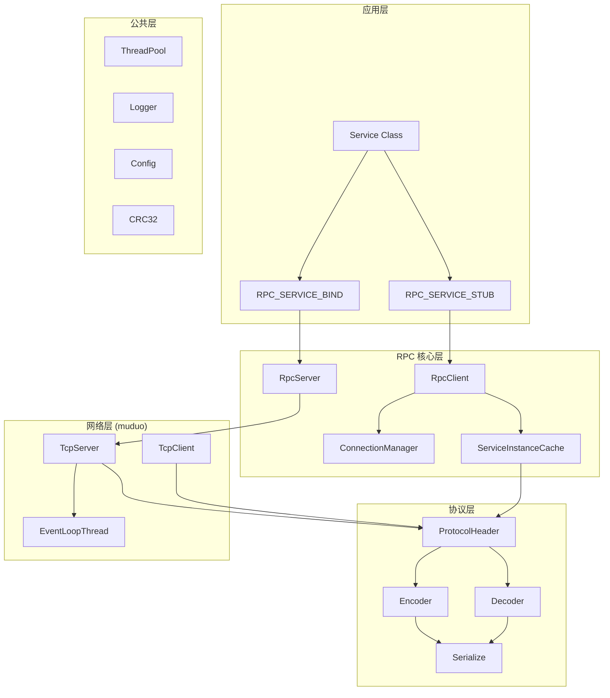
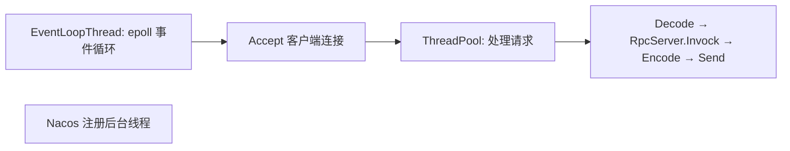
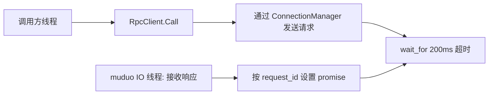

# 架构概览

mini-rpc 采用分层架构设计，自底向上分为四个核心层次，每层职责清晰、边界明确。网络层基于 [muduo](https://github.com/chenshuo/muduo) 网络库实现。

## 架构图

```mermaid
graph TB
    subgraph Application["应用层"]
        S[Service Class]
        M1[RPC_SERVICE_BIND]
        M2[RPC_SERVICE_STUB]
        S --> M1
        S --> M2
    end

    subgraph Core["RPC 核心层"]
        RS[RpcServer]
        RC[RpcClient]
        CM[ConnectionManager]
        SIC[ServiceInstanceCache]
        RC --> CM
        RC --> SIC
    end

    subgraph Net["网络层 (muduo)"]
        TS[TcpServer]
        TC[TcpClient]
        EL[EventLoopThread]
        TS --> EL
    end

    subgraph Protocol["协议层"]
        P[ProtocolHeader]
        E[Encoder]
        D[Decoder]
        S2[Serialize]
        P --> E
        P --> D
        E --> S2
        D --> S2
    end

    subgraph Common["公共层"]
        TP[ThreadPool]
        LG[Logger]
        CF[Config]
        CR[CRC32]
    end

    M1 --> RS
    M2 --> RC
    RS --> TS
    TS --> P
    TC --> P
    SIC --> P
```

## 层次说明

### 1. 协议层 (Protocol)

定义 RPC 通信的**数据格式**，是整个框架的基石。

- **ProtocolHeader**: 27 字节固定头部，包含魔术字 `0x5250`、版本号、消息类型、序列化方式、请求 ID、报文体长度、CRC32 校验码等
- **Encoder**: 将服务名 + 序列化数据组装为完整数据包 `[header | srv_name | body | check_num(4 bytes)]`
- **Decoder**: 解析二进制数据，验证魔术字和 CRC32，提取消息头与内容
- **Serialize**: 自动根据类型选择序列化方式：
  - 继承自 `google::protobuf::Message` → Protobuf 序列化
  - 其他类型 → JSON 序列化 (nlohmann/json)

### 2. 网络层 (Network)

基于 **muduo** 网络库封装的 **TCP 连接管理**。

- **TcpServer**: 服务端 TCP 服务器，基于 muduo `EventLoopThread` 实现多线程事件循环
- **TcpClient**: 客户端 TCP 连接封装，管理 muduo `TcpClient` 生命周期
- **ConnectionManager**: 连接管理器，维护到服务端各节点的连接池，支持随机选择连接
- **EndPoint**: 网络端点（host:port），用于标识服务端节点

### 3. RPC 核心层 (Core)

实现 **RPC 语义**：服务注册、方法绑定、请求路由、连接管理。

- **RpcServer**: 服务注册与管理，维护 `方法名 → 处理函数` 的映射表
- **RpcClient**: 单例模式的 RPC 客户端，通过 `request_id` 关联请求与响应
- **ConnectionManager**: 管理到多个服务端节点的连接，随机选择健康连接
- **ServiceInstanceCache**: Nacos 服务实例订阅缓存，基于 `EventListener` 模式实时更新实例列表
- **PendingRequest**: 挂起的 RPC 请求，关联连接和 promise

### 4. 公共层 (Common)

提供框架通用的**基础设施组件**。

- **ThreadPool**: 线程池，基于 `std::packaged_task` + `std::future` 实现异步任务
- **Logger**: 日志系统，支持同步/异步写入、多级日志过滤
- **Config**: TOML 配置文件加载器，支持服务端口、Nacos 地址等配置
- **Random**: 线程安全的随机数生成器，基于 `mt19937`
- **CRC32**: 循环冗余校验，用于数据包完整性验证
- **TimeStamp**: 微秒级时间戳

## 线程模型

### 服务端

```mermaid
graph LR
    EL[EventLoopThread: epoll 事件循环] --> Accept[Accept 客户端连接]
    Accept --> Pool[ThreadPool: 处理请求]
    Pool --> Handler[Decode → RpcServer.Invock → Encode → Send]
    Reg[Nacos 注册后台线程]
```

- **EventLoopThread**: muduo 事件循环线程，处理所有 I/O 事件
- **ThreadPool**: 服务端请求处理线程池
- **Nacos 注册线程**: 后台向 Nacos 注册服务实例

### 客户端

```mermaid
graph LR
    Caller[调用方线程] --> Call[RpcClient.Call]
    Call --> Send[通过 ConnectionManager 发送请求]
    Send --> Wait[wait_for 200ms 超时]
    Handler[muduo IO 线程: 接收响应]
    Handler --> Match[按 request_id 设置 promise]
    Match --> Wait
```

- **调用方线程**: 调用 stub 方法，序列化参数，发送请求，阻塞等待响应 (200ms 超时)
- **muduo IO 线程**: TcpClient 内部的事件循环，接收响应后按 request_id 匹配 promise
- **ServiceInstanceCache**: 基于 Nacos 订阅模式，后台实时更新服务实例列表（无阻塞）

## 数据流

完整的 RPC 调用流程：

1. **客户端**: `stub.method(args)` → `RpcClient::Call()` 序列化参数
2. **编码**: `Encoder::EncodeReq()` 构建完整数据包（Header + ServiceName + Body + CRC32 CheckNum）
3. **服务发现**: `ServiceInstanceCache` 从订阅缓存中获取实例列表（无网络 IO）
4. **发送**: `ConnectionManager` 随机选择健康连接，发送数据包到服务端
5. **服务端**: muduo 事件循环接收数据 → `RpcServer::MessageHandler` 解码 → `RpcServer::Invock()` 查找并调用对应方法
6. **响应**: `Encoder::SuccessRes()` 编码响应 → 发送回客户端
7. **客户端**: muduo IO 线程接收响应 → `RpcClient::MessageHandler` 通过 request_id 找到 promise → `set_value()` → 解除阻塞
8. **结果**: 反序列化响应体，返回给调用方
